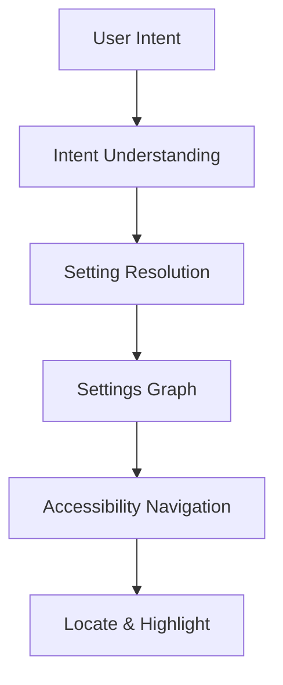
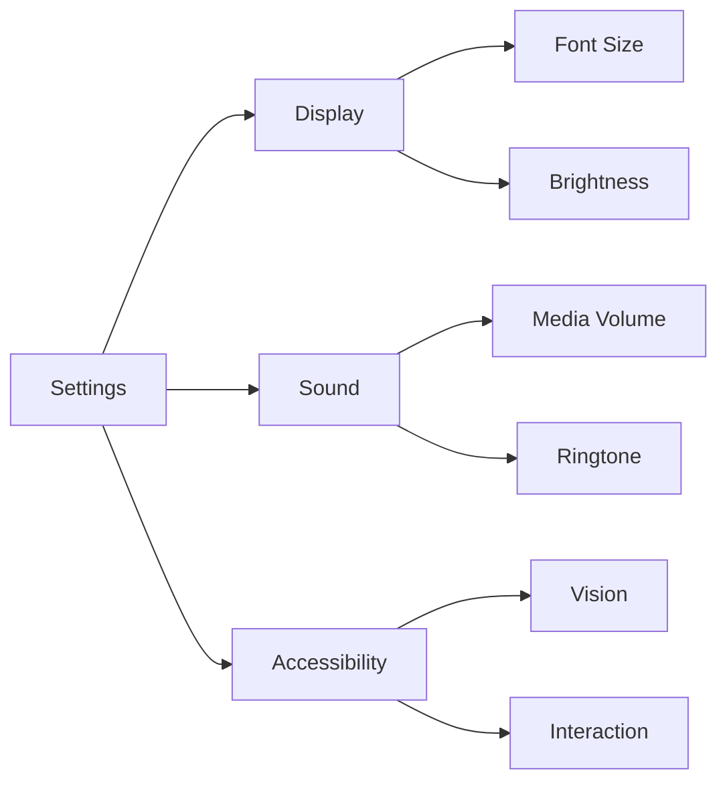
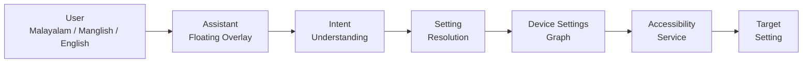

# Settings Assistant

[](#tech-stack)
[](#tech-stack)
[](#how-it-works)
[](#status)

## Stop searching. Start speaking.

Most Settings interfaces are built around **technical terminology and menu hierarchies**.

People think in outcomes.

> *"Phone-il call varumbol flash blink cheyyanam."*

They know what they want.
They just don't know **what it's called or where to find it.**

**Settings Assistant changes that.**

It converts natural-language intent into a target Android setting and navigates the user there — across **Malayalam, Manglish, and English**.

## Quick Navigation

* [The Problem](#the-problem)
* [Quick Example](#quick-example)
* [How It Works](#how-it-works)
* [Settings Graph](#settings-graph)
* [Why It Matters](#why-it-matters)
* [Tech Stack](#tech-stack)
* [Status](#status)

## The Problem

We surveyed **124 people** to validate the problem.

| Finding                                               |  Result |
| ----------------------------------------------------- | ------: |
| Wanted to change a setting but didn't know how        | **63%** |
| Think in Malayalam / Manglish while using their phone | **51%** |
| Rated a natural-language Settings Assistant 4–5 / 5   | **76%** |

The problem isn't that the setting doesn't exist.

It's the gap between:

```text
What the user wants
        ↓
What Android calls it
        ↓
Where Android puts it
```

## Quick Example

### Input

```text
phone-il letters valuthakkanam
```

### System

```text
Intent
   ↓
Text / Font Size
   ↓
Settings Graph
   ↓
Android Settings
   ↓
Target Control
```

The goal isn't to tell the user where to go.

**The goal is to get them there.**

## How It Works



### Intent Understanding

Natural language is converted into a structured representation of what the user wants.

### Setting Resolution

The intent is mapped to a relevant Android setting.

### Settings Graph

The system discovers the device's actual Settings hierarchy instead of assuming one universal path.

### Accessibility Navigation

The Android Accessibility Service traverses the UI, finds the target, and brings it into focus.

---

## Settings Graph

Android Settings aren't consistent across devices.

A setting may exist under different menus or have different labels across Samsung, Xiaomi, Pixel, and other OEMs.

Instead of relying entirely on static paths, Settings Assistant builds a representation of the **actual device Settings UI**.



This makes the navigation layer **device-aware**.

## Ambiguity Handling

Natural language can be ambiguous.

```text
"Sound kurakkanam"
```

could refer to ringtone, media, alarm, or call volume.

Instead of guessing:

```text
Which sound do you want to reduce?

→ Ringtone
→ Media
→ Alarm
→ Call
```

**When confidence is low, clarify before acting.**

## Why It Matters

Traditional settings:

```text
User → Learn terminology → Navigate menus → Find setting
```

Settings Assistant:

```text
User → Express intent → System resolves → Navigate
```

The larger idea is **intent-driven system navigation**.

Users shouldn't need to understand how the operating system is organized just to make it do what they want.

## Tech Stack

* **Android:** Kotlin, Accessibility Service
* **Backend:** Python, FastAPI
* **AI:** LLM-based intent understanding
* **Speech:** STT / multilingual speech pipeline
* **Data:** JSON-based Settings Graph
* **Languages:** Malayalam · Manglish · English
* **Language APIs:** Bhashini / ULCA exploration

## Architecture



The LLM is responsible for **understanding**.

The Accessibility Service is responsible for **execution**.

This keeps language-model reasoning separated from direct device interaction.


## Status

**Research Prototype**

Core intent → resolution → navigation functionality is being developed further, with current work focused on:

* Cross-OEM Settings crawling
* Robust UI target detection
* Malayalam / Manglish understanding
* Ambiguity resolution
* Reliable navigation and recovery

---

<div align="center">

### Don't make people learn the phone.

### Make the phone understand the people.

</div>
